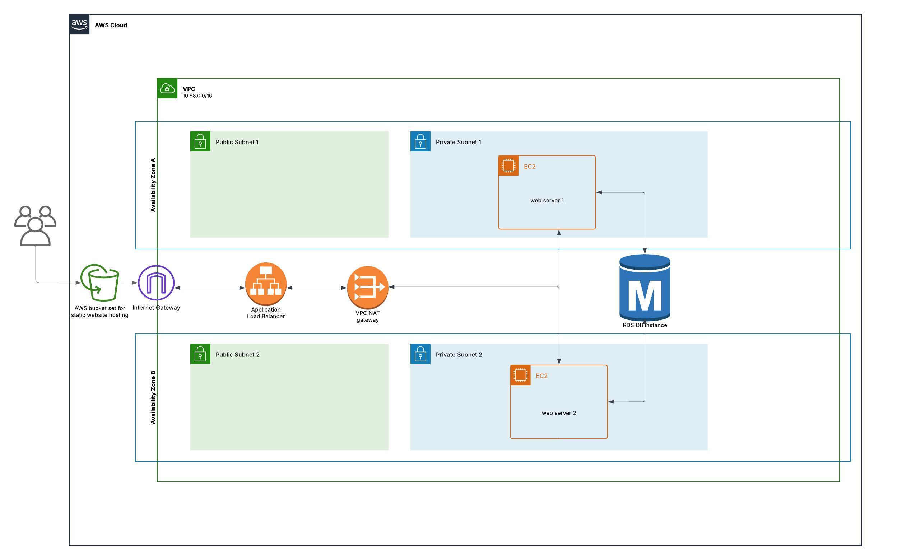

# DevOps Project 2
## Project Goal
Use terraform to create AWS infrastructure that can deploy a simple app
## AWS infrastructure
Running the main.tf will create the following resources in AWS:
* AWS S3 bucket to host a static website that will be publicly accessible
* VPC that contains 2 public and 2 private subnets
* An internet gateway that will be connected to the public subnets
* A NAT gateway placed within a public subnet, assigned to both private subnets
* Two EC2 instances placed within a different private subnet each, used to host the backend nest app
* A load balancer pointing to the privately hosted EC2 instances allowing public communication from the static site
* An RDS PosgreSQL database hosted within the private subnets and denied public access
* Two security groups, one for public HTTP and HTTPS traffic, and another for communication within the VPC
## AWS architecture diagram

## Demo Webapp
The webapp used the nest.js framework to build the backend to communicate with the database,
while the frontend used Angular.js to create a static webpage that will be served via an AWS S3 bucket.
### Frontend Info
Only select frontend files from the dist folder are uploaded to the S3 bucket that hosts the website. 
This is why the dist folder is included in the github.
When the project is rebuilt, the file names will need to be updated within the terraform s3 objects.
The load balancer DNS is output to a file that is then uploaded to the S3 website. This allows the frontend to 
find the the correct DNS to communicate with the backend.
The UI is a very simple html webpage at the moment. It consists solely of a form field that can be filled and submitted 
to the backend and database by pressing enter. The database contents are displayed underneath the form in a list.
### Backend Info
Because the database private DNS updates everytime the infrastructure is deployed, the terraform file
updates the ENV file through user data. To connect the backend to a database without the terraform file, you
will have to create the ENV file yourself instead of terraform doing it for you.
## Using the app
Before trying to deploy this sample architecture, make sure to configure your AWS CLI settings through the command 

* aws configure

or 

* aws configure sso

To reproduce this demo app, run the following commands in the directory containin main.tf after downloading terraform

* terraform init (initializes terraform and downloads required providors)
* terraform validate (optional, confirms terraform file has no errors)
* terraform plan (optional, displays what will be created)
* terraform apply (will ask for confirmation after displaying terraform plan)

After running terraform apply and confirming the build plan, terraform will build out the resources needed and begin hosting the sample website.
Go to the S3 DNS returned to view the website, which should just be a single form field. Wait a few minutes for all the resources to finish 
spinning up, then try entering text into the field and pressing enter.
The text you entered should appear below the field. This text is pulled from the database, and will not disappear after refreshing or switching machines.

After the app is no longer needed run:

* terraform destroy

to get delete the app off of AWS and stop incurring charges on the account hosting the site.